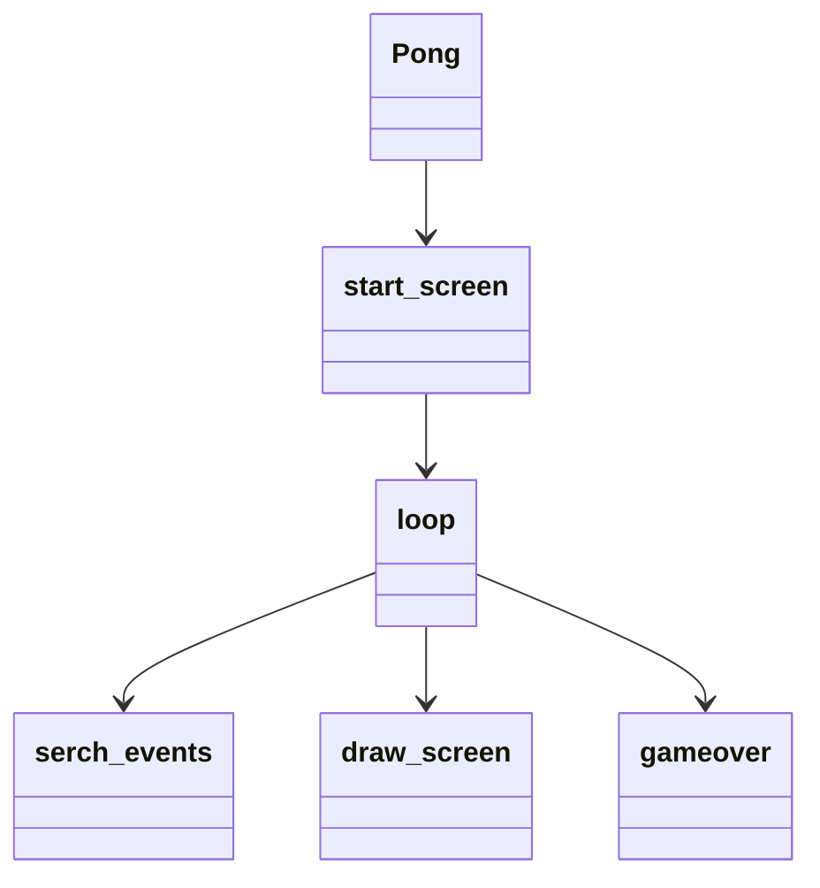

# Arkkitehtuurikuvaus
## Rakenne
Pong luokasta käyttäjä etenee metodiin start_screeniin, valittuaan vaikeusasteen Pong luokka alustaa muuttujia ja etenee lopuksi metodiin loop. Loop metodi pyörittää muita metodeita ja ohjaa käyttäjän pelin lopputtua gameover metodiin. 

